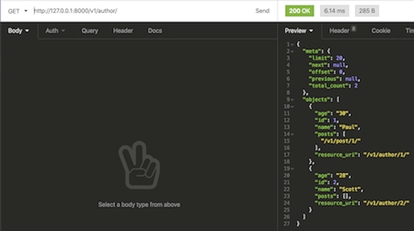
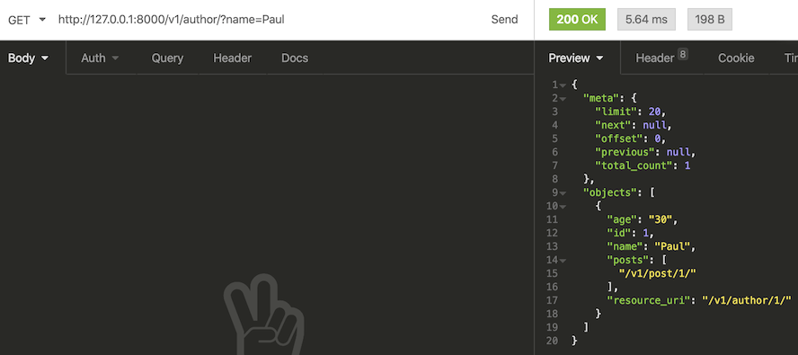
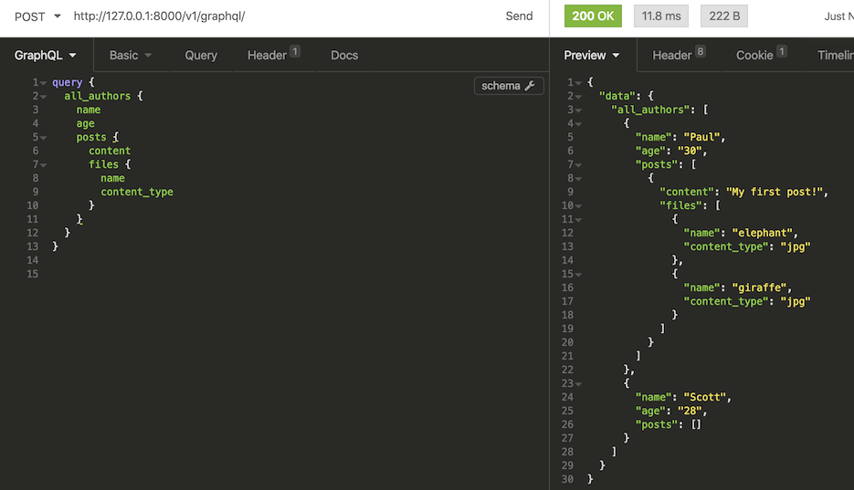
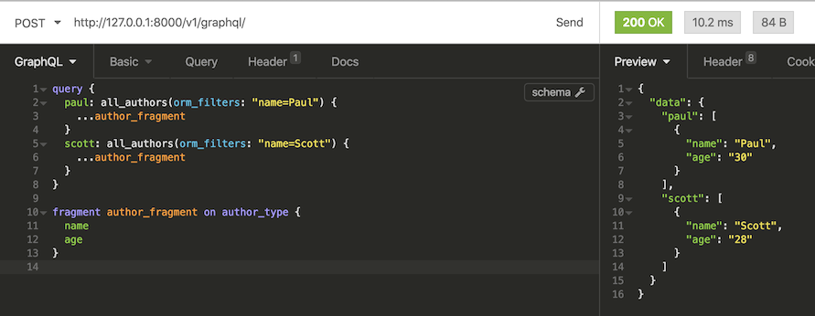

# GraphWrap #

GraphWrap is a python library which, by adding only a couple of lines of code, can extend an existing
[django-tastypie](https://django-tastypie.readthedocs.io/en/latest/)
REST-based API with a [GraphQL](https://graphql.org/learn/) interface.
This is achieved by leveraging [Graphene-Django](https://docs.graphene-python.org/projects/django/en/latest/) to dynamically 
build, at runtime, a GraphQL ObjectType for each tastypie resource. These ObjectTypes are then pieced together to
form a GraphQL schema which has the same "shape" as your existing REST API. 
Note that GraphWrap is **not** designed to build a GraphQL schema to replace your existing REST API,
but rather extend it to offer an additional GraphQL-queryable interface.

## Highlights:

* The dynamic nature of the build of the GraphQL layer means that you can continue to develop your existing
REST based API and know that the graphql schema will be kept up-to-date automatically. 

* Since the graphql layer is using the REST API under-the-hood, you can be sure that important things
like **serialization** (including any custom dehydration), **authentication** and **authorization** will be 
consistent between a REST resource and the corresponding GraphQL type.
 
* No longer will you be required to hardcode `full=True` to any of your tastypie resource fields - the client can simply
  make use of the GraphQL layer to retrieve data from related resources. This can lead to significant performance boosts
  in certain circumstances (One of the advantages of GraphQL queries is that they solve the [n+1 problem](
  https://itnext.io/what-is-the-n-1-problem-in-graphql-dd4921cb3c1a) which occurs with traditional REST-based APIs.)
 


## Limitations

Here are a couple of limitations of the GraphQL API produced by GraphWrap:

* It can only accept GraphQL [queries](https://graphql.org/learn/queries/) - mutations and subscriptions
  are not (yet) supported.

* The schema is built only from tastypie resources which inherit directly from `ModelResource` - non-ORM based
  resources are not (yet) supported.
  
  
## Future Directions

The long term goal for this project is to give the ability to add automatic GraphQL query support to any
Django view based REST framework.
  


## Quickstart


### Core Requirements

* `graphene-django==2.9.0` 

* `django-tastypie>=0.14.0"`

Each of the above requirements can be run using Python >=2.7 and Django >=1.11.

### Installing

`pip install graph_wrap`


### Registering the GraphQL resource

GraphWrap exposes the GraphQL schema via a tastypie resource (which is effectively a Django class-based view)
- `GraphQLResource`. As with all resources, we are required to register `GraphQLResource` with the tastypie Api instance
before we can interact with it via HTTP requests. Once registered, `GraphQLResource` builds and exposes the a GraphQL
queryable schema via the `/graphql` endpoint.

```
# tests.urls.py
from graph_wrap import GraphQLResource  # add this line to your project

api = Api('v1')
api.register(GraphQLResource()) # add this line to your project

urlpatterns = [
    path(r'', include(api.urls)),
    ...
]

```

### Querying the GraphQL resource

GraphWrap exposes the GraphQL API via the `/graphql` URL. By default, this endpoint uses the default
authentication provided by tastypie's ``Resource`` class. Later versions of GraphWrap will allow this 
authentication to be extended via setting config.

### Settings

In order for GraphQL to be able to build the GraphQL schema from the tastypie Api instance, it needs
to know where that instance lives in your project. To allow GraphWrap to locate the Api instance, we can simply
add the full path of the instance to our django settings module. For example:

```
# tests.settings.py

TASTYPIE_API_PATH = 'tests.urls.api'
```


## Documentation (by Example)

In this section we give a brief overview of how to use GraphWrap via examining
a simple concrete example. 


#Set-up
Suppose we have the following basic django models and corresponding tastypie resources (
a fully executable version of this example can be found in graph_wrap.tests):

```
# models.py

class Author(models.Model):
    name = models.TextField()
    age = models.TextField()


class Post(models.Model):
    content = models.TextField()
    date = models.DateTimeField()
    author = models.ForeignKey(Author, null=True, on_delete=models.SET_NULL)
    files = models.ManyToManyField('Media')


class Media(models.Model):
    name = models.TextField()
    content_type = models.TextField()
    size = models.BigIntegerField()


# api.py

class AuthorResource(ModelResource):
    posts = fields.ManyToManyField('tests.api.PostResource', attribute='post_set')

    class Meta:
        queryset = Author.objects.all()
        resource_name = 'author'
        filtering = {
            'age': ('exact',),
            'name': ('exact',),
        }


class PostResource(ModelResource):
    author = fields.ForeignKey(AuthorResource, attribute='author', null=True)
    files = fields.ManyToManyField('tests.api.MediaResource', attribute='files')
    date = fields.DateTimeField('date')

    class Meta:
        queryset = Post.objects.all()
        resource_name = 'post'


class MediaResource(ModelResource):
    class Meta:
        queryset = Media.objects.all()
        resource_name = 'media'
```

If we wish to layer our REST resources with a GraphQL interface, we can follow the instructions above in the
"Quickstart" guide. Start by registering our GraphQLResource with the tastypie Api instance:

```
# urls.py

from django.contrib import admin
from django.urls import path, include
from tastypie.api import Api

from graph_wrap import GraphQLResource
from tests.api import AuthorResource, PostResource, MediaResource


api = Api('v1')
api.register(AuthorResource())
api.register(PostResource())
api.register(MediaResource())
api.register(GraphQLResource())

urlpatterns = [
    path(r'', include(api.urls)),
    path('admin/', admin.site.urls),
]
```

Next, add the `TASTYPIE_API_PATH` to the django settings module so GraphWrap can locate the tastypie Api:

```
TASTYPIE_API_PATH = 'tests.urls.api'
```

### Understanding the Schema
With these simple changes, we can now query the  `/grahql` endpoint with GraphQL queries. The structure
queries can take, as with all GraphQL APIs, is dictated by the shape of the underlying schema (which, in this case, is
dictated by the shape of the tastypie API). To see what the schema looks like, run the following:

```
>>> from graph_wrap import schema
>>> schema = schema()
>>> print(schema)


schema {
  query: Query
}
type Query {
  author(id: Int!): author_type
  all_authors(orm_filters: String): [author_type]
  post(id: Int!): post_type
  all_posts(orm_filters: String): [post_type]
  media(id: Int!): media_type
  all_medias(orm_filters: String): [media_type]
}
type author_type {
  resource_uri: String!
  posts: [post_type]!
  id: Int!
  name: String!
  age: String!
}
type media_type {
  resource_uri: String!
  id: Int!
  name: String!
  content_type: String!
  size: Int!
}
type post_type {
  resource_uri: String!
  author: author_type
  files: [media_type]!
  date: String!
  id: Int!
  content: String!
}

```

Important points to note about the schema produced by GraphWrap:

* **snake_case**: As can be seen above, GraphWrap produces a schema in the `snake_case` convention. Whilst
  this is generally not favoured in GraphQL circles, it was chosen here as it would likely be more consistent with
  the field names on the underlying REST resources (which would use most often use the PEP8 recommended snake 
  case convention).
  
* **Root Query field names**: For each REST model-resource, GraphWrap adds to the Query type precisely
  two fields - one corresponding to the data accessible via a GET request to the 'list' endpoint of the
  resource, and one corresponding to the data accessible via a GET request to the 'detail' endpoint of the
  resource. If we take our AuthorResource as an example:
    * the 'list' endpoint corresponds to the url `/author`. This maps to the `all_authors` field on the Query type.
    * the 'detail' endpoint corresponds to urls of the form '/author/{author_pk}'. This maps to the `author(id: Int!)`
      field on the Query type (where, in the usual GraphQL schema syntax, `(id: Int!)` indicates that an integer author
      id must be supplied.)
      
* **ObjectType and ObjectType Field names**: 
    * GraphWrap maps each model-resource maps to a GraphQL
      ObjectType. The name of the resultant ObjectType can be found by appending `_type` to the name of the
      corresponding resource. For example, the `AuthorResource`, which has name `author`, maps to the `author_type`
      GraphQL ObjectType. 
    * The names of the fields on each ObjectType match those of the names of the fields on the corresponding
      resource.
      
* **Filtering (`orm_filters`)**: Notice in the schema above that each `all_` field can be queried with an optional 
    `orm_filters` argument. This is the GraphQL equivalent of the ORM filtering offered by tastypie on list endpoints.
    If we take our AuthorResource as an example (which has been defined with 
    `filtering = {'age': ('exact',), 'name': ('exact',)})`, then the REST GET query `/author/?name=Paul` can be achieved
    via a POST request to `/graphql` with the following query:
    
    ```
    {
      all_authors(orm_filters: "name=Paul") {
        name
      }
    }
    ```
   
  
   
## Making Queries: REST vs GraphQL

In this section we'll look at how various REST GET requests can be mapped to queries for the ``/graphql``
endpoint. Again, we'll do this via examining our explicit concrete example (note that the queries
and requests pictured in this section were produced on the [Insomnia](https://insomnia.rest/)
HTTP client, which has a integration with GraphQL):


### 'list' endpoint requests

* REST:




* GraphQL


### 'detail' endpoint requests

* REST


* GraphQL


### Filtering

* REST




* GraphQL


### Some fancier GraphQL query examples - see GraphQL [queries](https://graphql.org/learn/queries/) for more

* Nesting




* Fragments




